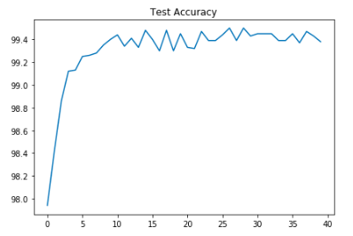

# S6
EVA4 Session 6 assginment

## Baseline without L1 and L2 regularization

### Results .  

1.   Best Train Accuracy 98.41%
2.   Best Test Accuracy 99.58%

### Analysis   

1.  Accuracy > 99.40 consistently more than 4 instances.
2.  Model performance is good as difference between train and test is small.

## With L1 Regularization

### Results .  

1.   Best Train Accuracy 99.42%
2.   Best Test Accuracy 99.57%

### Analysis   

1.  L1 Regularization reduces the gap between test and train accuracy.

### Plots

## Step 3

### Target . 

1.   Eventhough the model is under-fitting and we need to add more parameters. We need to optimizing of output channels to decrease the parameters < 10 K to meet the requirement.

### Results .  

1.   Parameters: 9,752
2.   Best Train Accuracy 99.24%
3.   Best Test Accuracy 99.39%

### Analysis   

1.  Total parameters < 10k
2.  Model performance is good but not achieving 99.4% accuracy target.

## Step 4

### Target . 

1.   Add image augmentation w random rotation and random affine to improve the model performance.

### Results .  

1.   Parameters: 9,752
2.   Best Train Accuracy 98.03%
3.   Best Test Accuracy 99.26%

### Analysis   

1.  Total parameters < 10k
2.  Data augmentation didn't improve the accuracy.

## Step 5

### Target . 

1.   Adding LR Scheduler 
2.   Iterated on learning rate (0.01, 0.02)
3.   Iterated on removing batch-norm and drop-out in initial layer of convolution.

### Results .  

1.   Parameters: 9,712
2.   Best Train Accuracy 99.22%
3.   Best Test Accuracy 99.48%

### Analysis   

1.  Total parameters < 10k
2.  Accuracy > 99.40 consistently for 4 instances in 15 epochs.
3.  Model performance is good as difference between train and test is small.

