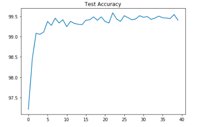
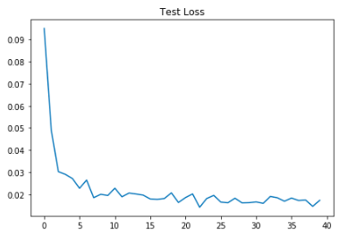
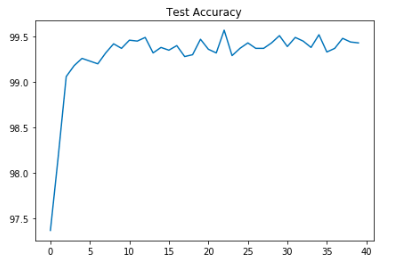
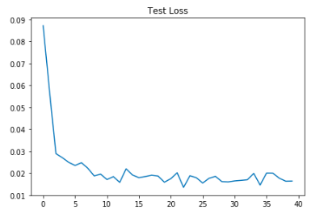
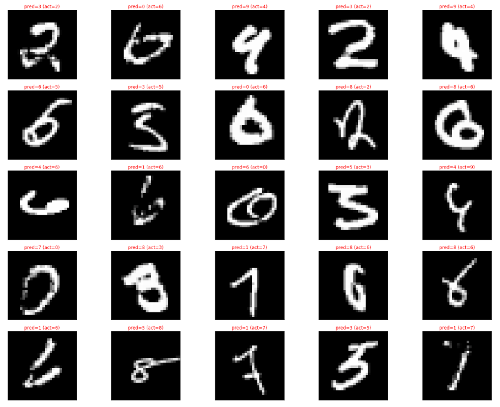
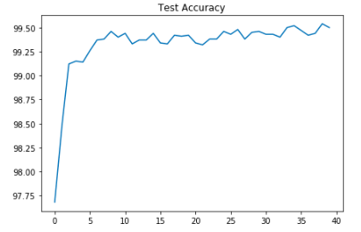
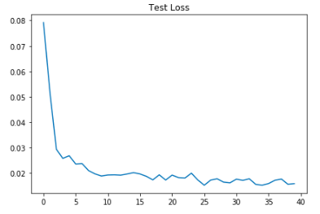
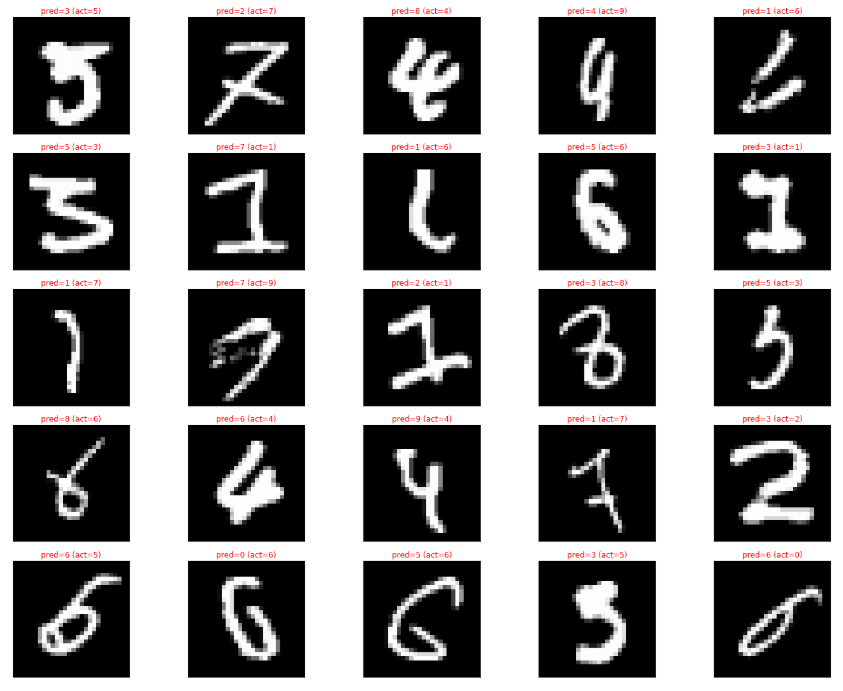
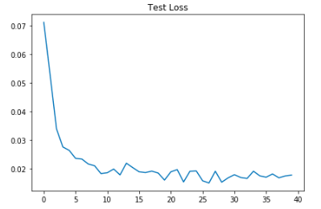

# S6
EVA4 Session 6 assginment

## Baseline without L1 and L2 regularization

### Results .  

1.   Best Train Accuracy 98.41%
2.   Best Test Accuracy 99.58%

### Analysis   

1.  Accuracy > 99.40 consistently more than 4 instances.
2.  Model performance is good as difference between train and test is small.

### Plots

 

## With L1 Regularization

### Results .  

1.   Best Train Accuracy 99.42%
2.   Best Test Accuracy 99.57%

### Analysis   

1.  L1 Regularization reduces the gap between test and train accuracy.

### Plots

 

### Mislabeled plots (25 images)

## L2 regularization

### Results  

1.   Best Train Accuracy 99.59%
2.   Best Test Accuracy 99.54%

### Analysis   

1.  L2 regularization improves train accuracy and reduce difference with test accuracy. Model performanc is better than L1 regularization.

### Plots

 

### Mislabeled plots (25 images)

## With L1 & L2 regularization

### Results  

1.   Best Train Accuracy 99.44%
2.   Best Test Accuracy 99.50%

### Analysis   

1.  Results didn't improve by combining L1 and L2 regularization as compared just using L2 regularization.

### Plots

 

